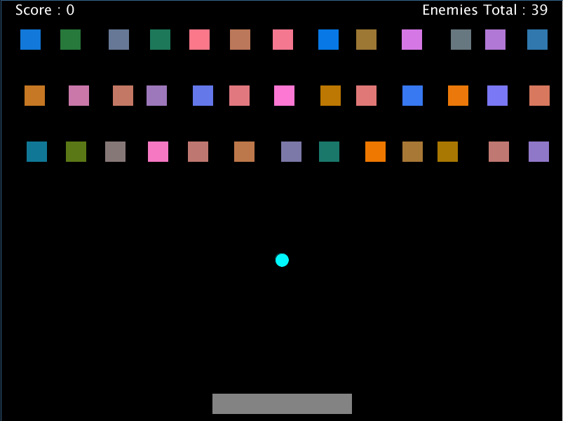
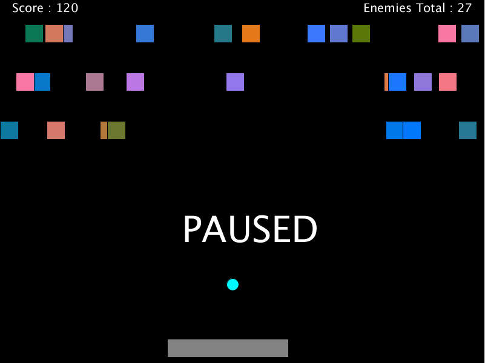

# shape-invaders

Simple game, it's pong + space invaders but with only basic shapes.

## Usage

LightTable - open `core.clj` and press `Ctrl+Shift+Enter` to evaluate the file.

Emacs - run cider, open `core.clj` and press `C-c C-k` to evaluate the file.

REPL - run `(require 'pong-shape-game.core)`.

## License

Copyright © 2018 Moch Deden

Distributed under the Eclipse Public License either version 1.0 or (at
your option) any later version.
